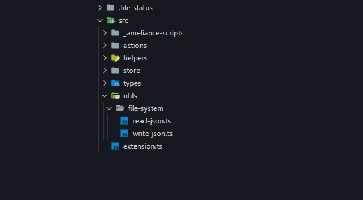

# File Status Badge

An extension for tracking the status of work on a file (or a folder). It can be useful when you need to switch to working with another file, but after a while you don't always remember whether you needed to finish something in the file or not. It also happens that you realize that the file needs to be finalized, but you don't have time for it.

## Features



## Requirements

If you have any requirements or dependencies, add a section describing those and how to install and configure them.

## Extension Settings

```
.file-status/ — extension folder
	data.json — extension data
	settings.json — extension settings
```

To customize your own badges, add file `settings.json` to folder `.file-status/`

You can use any one character

```json
{
	"badges": {
		"todo": {
			"badge": "🔳"
		},
		"inProgress": {
			"badge": "⏳"
		},
		"testing": {
			"badge": "🔬"
		},
		"done": {
			"badge": "✅"
		}
	}
}
```

and the text (also you can change the tooltip)

```json
{
	"badges": {
		"todo": {
			"badge": "▢",
			"tooltip": "Not Started"
		},
		"inProgress": {
			"badge": "~",
			"tooltip": "Active"
		},
		"testing": {
			"badge": "β",
			"tooltip": "Lab"
		},
		"done": {
			"badge": "✓",
			"tooltip": "Completed"
		}
	}
}
```

## Release Notes

```
0.0.1 [2024_05_11]:
   +: Initial release of File Status Badge extension
```

---

[](https://www.buymeacoffee.com/ameliance)
